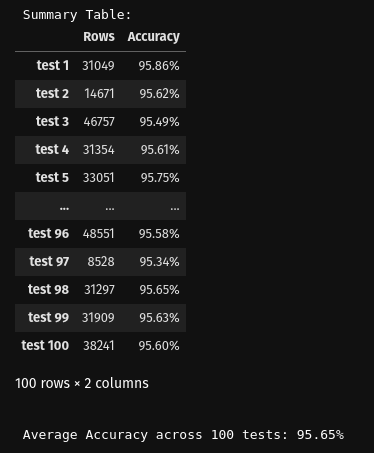

# Whiskey Classificator demo

## Overview

This project has been developed with the purpouse of building a Gradio app in Hugging Face to make a demo using a model developed with scikit library, the project has different files:

- **notebook.ipynb**: Where the dataset to train model, dataset processment, _dataset_infos.json_ file and model creation happens.

- **gradio_demo_hf_conn.ipynb**: Where the library _huggingface_hub_ is used to call model from hugging face instead using local files.


## Features

- Create _SVM: Linear Kernel_ model with a custom name and save it in /home/$USER/Downloads
- Create processors to process datasets
- Create datasets
- Test model 1 time or 10 times in a loop in _**notebook.ipynb**_
- Test model in _Gradio_ app getting model from _Hugging Face_


## Requirements

The project has a _requirements.txt_ file, but, also has the required installations for testing with _Gradio_ in their own _notebook files_.

The required libraries are:
- For _**notebook.ipynb**_
    - faker
    - pandas
    - numpy
    - scikit-learn
    - matplotlib
    - datasets

- For _**gradio_demo_hf_conn.ipynb**_
    - gradio
    - huggingface_hub


## Installation

- Create a Conda environment, I used Python 3.10 (recommended)
```Bash
    conda create --name [env_name] python=3.10
```
- Clone this repository
```Bash
    https://github.com/Rogudev/Classificator_model_demo
```
- Copy repository files in your environment
```Bash
    cp "Classificator_model_demo/*" "[env_name]"
```

- Install dependencies after activating the environment
```Python
    pip install -r requirements.txt 
```


## How to Use

### notebook.ipynb
This notebook allow user to create a dataset to process it and save the data splited, with this data the model is trained.

This notebook has their own [documentation](https://huggingface.co/Rogudev/whiskey_classificator_model) in Hugging Face

The notebook has a cell where the test phase could be done in a loop, these are the results:


### gradio_demo_hf_conn.ipynb
This notebook allow user to test the model in a gradio app which uses the model and the processors from Hugging Face.

This notebook has their own [documentation](https://huggingface.co/spaces/Rogudev/Whiskey_classificator_demo/blob/main/README.md) in Hugging Face


## License

This project is licensed under the MIT License - see the information below for details.


MIT License

Copyright (c) 2025 Rodrigo Gutierez Ribal [rogudev.com](https://rogudev.com/es)

Permission is hereby granted, free of charge, to any person obtaining a copy
of this software and associated documentation files (the "Software"), to deal
in the Software without restriction, including without limitation the rights
to use, copy, modify, merge, publish, distribute, sublicense, and/or sell
copies of the Software, and to permit persons to whom the Software is
furnished to do so, subject to the following conditions:

The above copyright notice and this permission notice shall be included in all
copies or substantial portions of the Software.

THE SOFTWARE IS PROVIDED "AS IS", WITHOUT WARRANTY OF ANY KIND, EXPRESS OR
IMPLIED, INCLUDING BUT NOT LIMITED TO THE WARRANTIES OF MERCHANTABILITY,
FITNESS FOR A PARTICULAR PURPOSE AND NONINFRINGEMENT. IN NO EVENT SHALL THE
AUTHORS OR COPYRIGHT HOLDERS BE LIABLE FOR ANY CLAIM, DAMAGES OR OTHER
LIABILITY, WHETHER IN AN ACTION OF CONTRACT, TORT OR OTHERWISE, ARISING FROM,
OUT OF OR IN CONNECTION WITH THE SOFTWARE OR THE USE OR OTHER DEALINGS IN THE
SOFTWARE.
